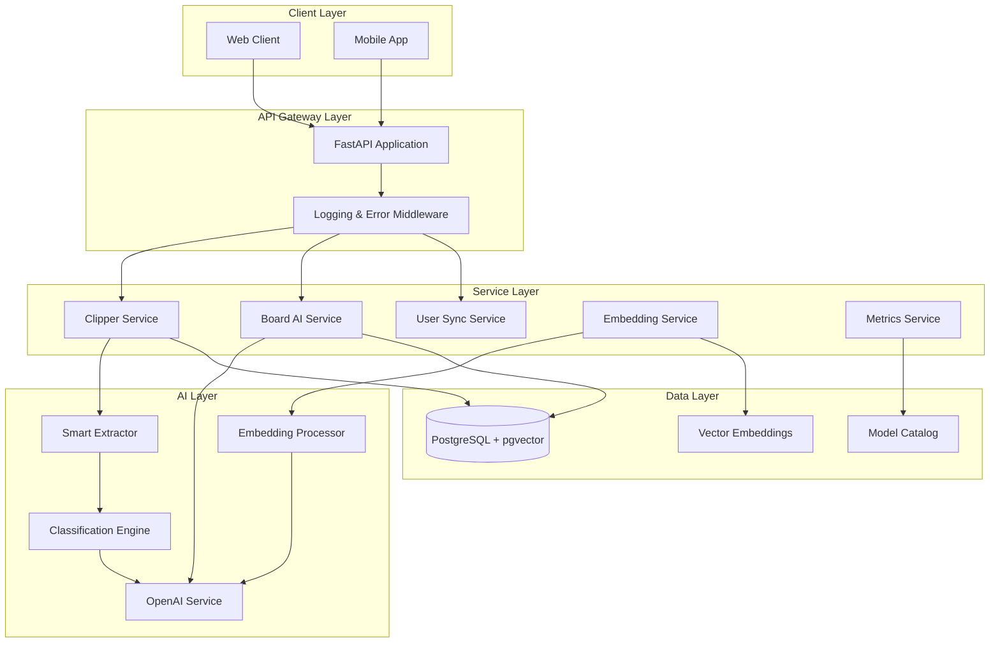
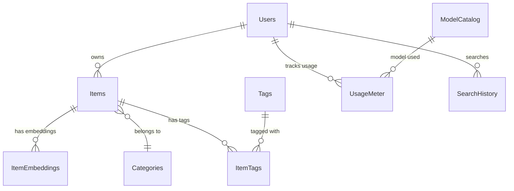
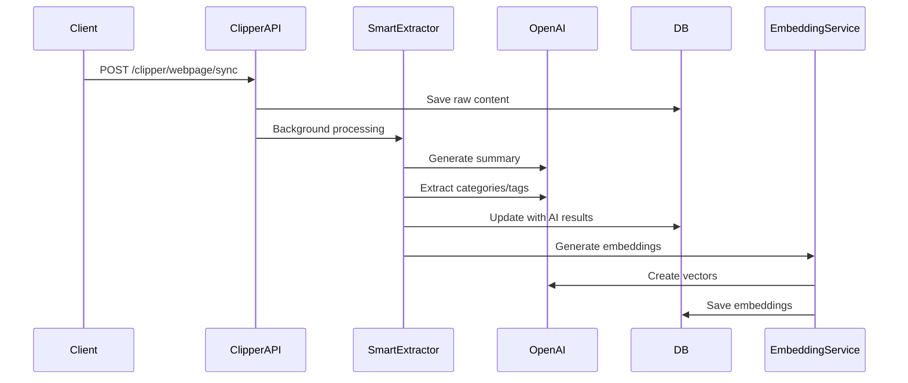
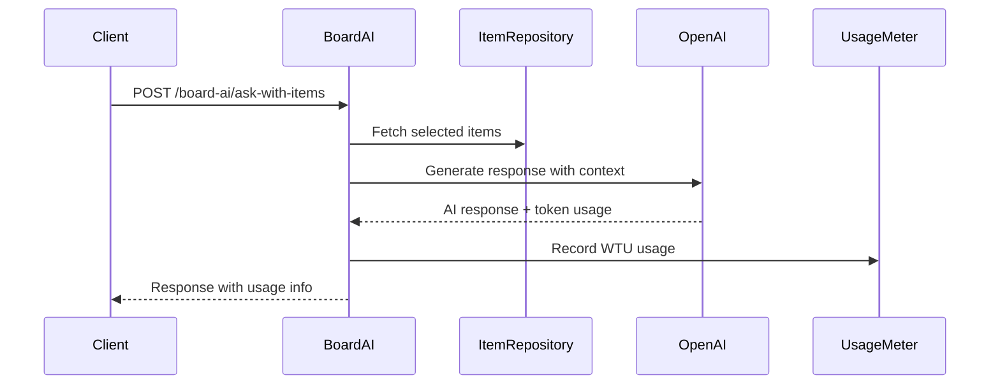

# LinkyBoard AI 시스템 아키텍처 분석

## 1. 프로젝트 개요

**LinkyBoard AI**는 웹 콘텐츠 클리핑, AI 기반 분석, 벡터 검색을 제공하는 FastAPI 기반 백엔드 시스템입니다.

### 주요 특징
- **AI 기반 콘텐츠 처리**: 웹페이지/YouTube 콘텐츠 자동 요약 및 태그 분류
- **벡터 임베딩 검색**: pgvector를 활용한 의미적 검색
- **WTU 기반 비용 관리**: Weighted Token Unit을 통한 AI 사용량 계측
- **개인화 AI 서비스**: 사용자 행동 기반 맞춤형 추천

## 2. 시스템 아키텍처

### 2.1 전체 구조도



### 2.2 핵심 모듈 구조

#### **1) AI 모듈 (`app/ai/`)**
```
ai/
├── classification/          # 콘텐츠 분류
│   ├── category_classifier.py
│   ├── tag_extractor.py
│   └── smart_extractor.py
├── embedding/              # 벡터 임베딩
│   ├── service.py
│   ├── repository.py
│   └── processors/
└── recommendation/         # 추천 시스템
    ├── content_scoring.py
    └── user_profiling.py
```

#### **2) 콘텐츠 수집 모듈 (`app/collect/`)**
```
collect/v1/
├── clipper/                # 웹/YouTube 콘텐츠 처리
│   ├── router.py
│   ├── service.py
│   └── schemas.py
└── content/                # 콘텐츠 관리
    ├── router.py
    └── service.py
```

#### **3) Board AI 모듈 (`app/board_ai/`)**
```
board_ai/
├── router.py               # AI 작업 API
├── service.py              # 선택된 아이템 기반 AI 서비스
└── schemas.py
```

## 3. 데이터베이스 스키마

### 3.1 핵심 테이블 구조

#### **Items 테이블** - 콘텐츠 저장
```sql
items (
  id: BigInteger (Spring Boot 동기화)
  user_id: BigInteger FK
  item_type: String (webpage/youtube/pdf)
  source_url: String
  title: String
  summary: Text (AI 생성)
  raw_content: Text (원본 콘텐츠)
  processing_status: String (raw/processed/embedded)
  category_id: BigInteger FK
)
```

#### **Vector Embeddings** - 임베딩 저장
```sql
item_embedding_metadatas (
  item_id: BigInteger FK
  chunk_number: Integer
  chunk_content: Text
  embedding_vector: Vector(1536)
  embedding_model: String
)
```

#### **Model Catalog** - AI 모델 관리
```sql
model_catalog (
  model_name: String
  provider: String (openai/anthropic)
  model_type: String (llm/embedding)
  weight_input/output/embedding: Float (WTU 가중치)
  price_input/output: Float (USD/1M tokens)
)
```

#### **Usage Meter** - 사용량 추적
```sql
usage_meter (
  user_id: BigInteger FK
  in_tokens/out_tokens/embed_tokens: Integer
  wtu: Integer (계산된 WTU)
  selected_model_id: BigInteger FK
  plan_month: Date
)
```

### 3.2 관계도


## 4. API 엔드포인트 구조

### 4.1 주요 API 그룹

#### **Clipper API (`/api/v1/clipper`)**
- `POST /webpage/sync` - 웹페이지 저장
- `POST /youtube/sync` - YouTube 동영상 저장  
- `POST /webpage/summarize` - 웹페이지 요약 생성
- `POST /youtube/summarize` - YouTube 요약 생성

#### **Board AI API (`/board-ai`)**
- `GET /models/available` - 사용 가능한 모델 조회
- `POST /models/estimate-cost` - 작업 비용 추정
- `POST /ask-with-items` - 선택된 아이템 기반 질의
- `POST /draft-with-items` - 선택된 아이템 기반 초안 작성

#### **Content API (`/api/v1/content`)**
- 콘텐츠 CRUD 및 검색

#### **User Sync API (`/user-sync`)**
- Spring Boot 서버와 사용자 동기화

#### **Admin Models API (`/admin/models`)**
- AI 모델 관리

## 5. 핵심 동작 흐름

### 5.1 콘텐츠 처리 파이프라인



### 5.2 Board AI 워크플로우



## 6. 기술 스택 및 특징

### 6.1 기술 스택
- **Backend**: FastAPI (Python 3.12+)
- **Database**: PostgreSQL 15+ with pgvector extension
- **AI Services**: OpenAI GPT-4, text-embedding-3-small
- **Vector Search**: pgvector
- **ORM**: SQLAlchemy with async support
- **Migration**: Alembic
- **Deployment**: Docker, Docker Compose

### 6.2 주요 기능 특징

#### **스마트 콘텐츠 처리**
- HTML 파싱 및 텍스트 추출
- YouTube 자막 기반 분석
- AI 기반 자동 요약 및 분류
- 사용자 개인화 태그 추천

#### **벡터 검색 시스템**
- 1536차원 임베딩 벡터
- 청크 단위 콘텐츠 분할
- 의미적 유사도 검색
- 하이브리드 검색 (키워드 + 벡터)

#### **WTU 비용 관리 시스템**
- 토큰 사용량 실시간 추적
- 모델별 가중치 적용
- 월별 사용량 집계
- 비용 예측 및 제어

#### **개인화 AI 서비스**
- 사용자 행동 패턴 분석
- 콘텐츠 추천 엔진
- 개인화된 태그/카테고리 제안

## 7. 확장성 및 성능 고려사항

### 7.1 성능 최적화
- **데이터베이스 인덱싱**: 벡터 검색 및 사용자별 쿼리 최적화
- **청크 기반 임베딩**: 대용량 콘텐츠 처리
- **비동기 처리**: FastAPI async/await 활용
- **백그라운드 작업**: 무거운 AI 작업 비동기 처리

### 7.2 확장 가능한 설계
- **모듈화된 구조**: 각 기능별 독립적 모듈
- **플러그인 가능한 AI 모델**: Model Catalog를 통한 모델 관리
- **마이크로서비스 준비**: 각 서비스의 독립적 배포 가능

이 아키텍처는 AI 기반 콘텐츠 처리와 개인화 서비스를 효율적으로 제공하면서, 확장성과 비용 관리를 고려한 현대적인 설계입니다.