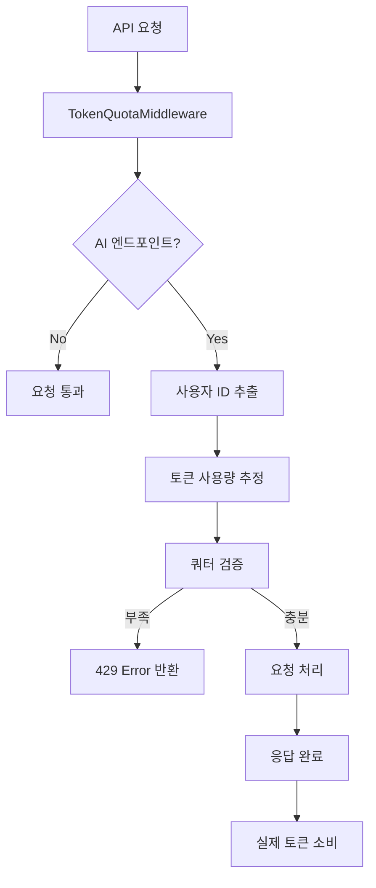

# 사용자별 토큰 쿼터 관리 시스템

본 문서는 사용자별 AI 토큰 사용량 추적 및 쿼터 관리 시스템에 대해 설명합니다.

## 📋 시스템 개요

사용자별로 월간 토큰 사용량을 추적하고, 할당량을 초과하기 전에 요청을 제한하는 시스템입니다.

### 주요 기능
- ✅ 사용자별 월간 토큰 할당량 관리
- ✅ AI 요청 전 토큰 잔량 검증
- ✅ 실시간 토큰 소비 추적
- ✅ 토큰 충전/구매 시스템
- ✅ 사용량 통계 및 이력 조회
- ✅ 다양한 결제 수단 지원

## 🏗️ 시스템 아키텍처

### 데이터베이스 모델

#### 1. UserTokenQuota
사용자의 월별 토큰 할당량과 사용량을 관리합니다.

```sql
CREATE TABLE user_token_quota (
    user_id BIGINT,
    plan_month DATE,
    allocated_quota INTEGER DEFAULT 10000,
    used_tokens INTEGER DEFAULT 0,
    remaining_tokens INTEGER DEFAULT 10000,
    total_purchased INTEGER DEFAULT 0,
    PRIMARY KEY (user_id, plan_month)
);
```

#### 2. TokenPurchase
토큰 구매/충전 이력을 관리합니다.

```sql
CREATE TABLE token_purchases (
    id BIGSERIAL PRIMARY KEY,
    user_id BIGINT,
    plan_month DATE,
    token_amount INTEGER,
    purchase_type VARCHAR(20) DEFAULT 'purchase',
    payment_method VARCHAR(50),
    payment_amount DECIMAL(10,2),
    currency VARCHAR(10) DEFAULT 'KRW',
    status VARCHAR(20) DEFAULT 'completed'
);
```

### 서비스 구조

```
app/
├── metrics/
│   ├── token_quota_service.py      # 토큰 쿼터 관리 핵심 로직
│   └── usage_recorder_v2.py        # 기존 사용량 기록 시스템
├── user_quota/
│   ├── router.py                   # API 엔드포인트
│   ├── schemas.py                  # Pydantic 모델
│   └── payment_service.py          # 결제 처리 서비스
└── core/
    └── middleware.py               # 토큰 쿼터 미들웨어
```

## 🔄 작동 방식

### 1. 요청 처리 플로우



### 2. 토큰 추정 로직

요청 내용을 분석하여 예상 토큰 사용량을 계산합니다:

- JSON 요청: 텍스트 필드의 내용 길이 기반 추정
- 엔드포인트별 기본값:
  - `/board-ai/`: 500 토큰
  - `/agents/`: 300 토큰
  - `/clipper/`: 200 토큰
  - `/embedding/`: 150 토큰

### 3. 실시간 검증

미들웨어가 모든 AI 관련 요청을 가로채서:
1. 사용자 ID 확인
2. 예상 토큰 사용량 계산
3. 현재 잔여 토큰과 비교
4. 부족 시 즉시 차단

## 📡 API 엔드포인트

### 토큰 쿼터 조회
```http
GET /api/v1/user-quota/quota
Headers: x-user-id: {user_id}
```

응답:
```json
{
  "user_id": 123,
  "plan_month": "2024-01-01",
  "allocated_quota": 10000,
  "used_tokens": 2500,
  "remaining_tokens": 7500,
  "usage_percentage": 0.25,
  "is_quota_exceeded": false
}
```

### 토큰 구매 패키지 조회
```http
GET /api/v1/user-quota/packages
```

응답:
```json
{
  "packages": [
    {
      "token_amount": 1000,
      "price": 1000,
      "currency": "KRW",
      "name": "기본 패키지",
      "discount_rate": 0
    },
    {
      "token_amount": 10000,
      "price": 8500,
      "currency": "KRW",
      "name": "프로 패키지",
      "discount_rate": 15,
      "recommended": true
    }
  ]
}
```

### 토큰 결제 처리
```http
POST /api/v1/user-quota/payment/process
Headers: x-user-id: {user_id}
Content-Type: application/json

{
  "token_amount": 1000,
  "payment_method": "card",
  "payment_data": {
    "card_number": "1234-5678-9012-3456",
    "card_type": "credit",
    "currency": "KRW"
  }
}
```

### 사용 이력 조회
```http
GET /api/v1/user-quota/usage-history
Headers: x-user-id: {user_id}
Query: plan_month=2024-01-01&limit=50
```

### 쿼터 사용 가능 여부 확인
```http
GET /api/v1/user-quota/quota/check/500
Headers: x-user-id: {user_id}
```

응답:
```json
{
  "user_id": 123,
  "required_tokens": 500,
  "available": true,
  "remaining_tokens": 7500,
  "total_quota": 10000
}
```

## 💳 결제 시스템

### 지원 결제 수단

1. **신용카드** (`card`)
2. **카카오페이** (`kakao_pay`)
3. **계좌이체** (`bank_transfer`)
4. **PayPal** (`paypal`)
5. **무료 체험** (`free_tier`)

### 토큰 패키지

| 토큰 수 | 가격 (KRW) | 할인율 | 토큰당 가격 |
|---------|------------|---------|-------------|
| 1,000   | 1,000      | 0%      | 1.00원      |
| 5,000   | 4,500      | 10%     | 0.90원      |
| 10,000  | 8,500      | 15%     | 0.85원      |
| 50,000  | 40,000     | 20%     | 0.80원      |
| 100,000 | 75,000     | 25%     | 0.75원      |

## 🛡️ 보안 및 제한

### 토큰 부족 시 응답
```json
{
  "error": "토큰 할당량이 부족합니다",
  "code": "INSUFFICIENT_TOKENS",
  "required_tokens": 500,
  "available_tokens": 100,
  "total_quota": 10000,
  "used_tokens": 9900
}
```

### 미들웨어 적용 엔드포인트
- `/api/v1/agents/`
- `/api/v1/board-ai/`
- `/api/v1/collect/v1/clipper/`
- `/api/v1/embedding/`
- `/api/v1/ai/`
- `/audio/`

## 📊 모니터링 및 분석

### 사용량 통계
- 월별 사용량 트렌드
- 사용자별 토큰 소비 패턴
- 인기 AI 기능 분석
- 수익 및 구매 패턴

### 알림 시스템
- 토큰 부족 (90% 사용 시)
- 할당량 초과 시도
- 구매 완료 알림
- 월간 사용량 리포트

## 🔧 설정 및 배포

### 환경변수
```env
# 기본 토큰 할당량
DEFAULT_TOKEN_QUOTA=10000

# 토큰 추정 기본값
DEFAULT_TOKEN_ESTIMATE=100

# 결제 시스템 설정
PAYMENT_PROVIDER_API_KEY=your_api_key
```

### 마이그레이션 실행
```bash
# 데이터베이스 테이블 생성
psql -d your_database -f migrations/add_token_quota_tables.sql
```

### 미들웨어 활성화
```python
# main.py에서 미들웨어 추가
app.add_middleware(TokenQuotaMiddleware)
```

## 🚀 향후 계획

### 단기 개선사항
- [ ] 실시간 사용량 대시보드
- [ ] 이메일/SMS 알림 시스템
- [ ] 기업용 대량 할인 패키지
- [ ] 토큰 선물하기 기능

### 장기 로드맵
- [ ] AI 사용 패턴 기반 개인화 추천
- [ ] 구독형 무제한 플랜
- [ ] 팀/조직 계정 관리
- [ ] 세분화된 기능별 토큰 가격 책정

## 🔍 트러블슈팅

### 자주 발생하는 문제

1. **토큰 추정 부정확**
   - 해결: 엔드포인트별 기본값 조정
   - 모니터링: 실제 사용량과 추정량 비교

2. **결제 실패**
   - 확인: PG사 API 상태
   - 로그: payment_service.py 로그 확인

3. **미들웨어 충돌**
   - 순서: 미들웨어 등록 순서 확인
   - 예외: 특정 엔드포인트 제외 설정

### 로그 확인
```bash
# 토큰 사용량 로그
grep "tokens for user" logs/ai.log

# 결제 관련 로그
grep "payment" logs/api.log

# 쿼터 초과 로그
grep "INSUFFICIENT_TOKENS" logs/api.log
```

## 📞 지원

문의사항이나 버그 리포트는 다음 채널을 통해 연락해 주세요:
- GitHub Issues: [linkyboard-ai/issues](https://github.com/wonjun0120/linkyboard-ai/issues)
- 이메일: support@linkyboard.com